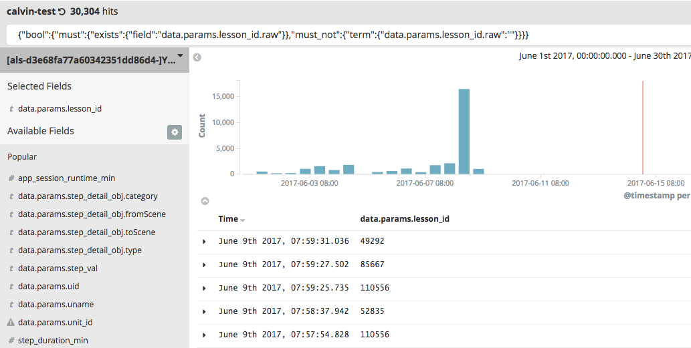

对于kibana的基础查询语法

kibana的查询语法有两种:

1. [Lucene query syntax]( https://lucene.apache.org/core/2_9_4/queryparsersyntax.html) 这个查询基本满足绝大部分功能了 
		
    * 通配符: ? 单个字符, *多个字符
	* 指定单词查询 title:"The Right Way" AND text:go
	* 范围查询: 
            
        data.params.db_runtime: [50 TO *] (大于等于50)
			 
        data.params.db_runtime: {50 TO *} (大于50)
	* 逻辑组合: AND OR NOT (必须大写)
	* 条件分组: ()
		    
        (FIELD1: 123 OR FIELD2: 456) AND FIELD3: XXX
		       
        FIELD: (VALUE1 OR VALUE2) 等价于 FIELD: (VALUE1 VALUE2)
		       
        FIELD: (+VALUE1 VALUE2)  (VALUE1必须存在 VALUE2可选)

  2. [Elasticsearch Query Syntax](https://www.elastic.co/guide/en/elasticsearch/reference/current/query-dsl.html) 有一些特殊的查询可以使用Elasticsearch提供的Query语句来实现

    * match_all: 查询所有文档
    * 全文搜索（对英文支持好）
        * match: 
        * match_phrase： 短语匹配（先将查询字符串解析成一个词项列表，然后对这些词项进行搜索）
        * match_phrase_prefix： 类似match_phrase只是最后一个词可以至提供前缀
        * multi_match： 在match的基础上对多个字段进行查询
        * common terms query：控制高低频次词在查询中的权重（停用词替代品）
        * simple_query_string： 像query_string，单数不会报异常，不符合语法的部分直接丢弃
        * query_string: 在kibana搜索框输入的内容就是转成这个

```json
{
    "query_string": {
        "query": "(content:this OR name:this) AND (content:that OR name:that)"
    }
}
{
    "query_string" : {
        "fields" : ["city.*"],
        "query" : "this AND that OR thus",
        "use_dis_max" : true
    }
}

```

    * Term level queries
        * term： 在倒排索引中进行精确查找（小心text的分词导致的匹配不到）
        * terms： 想到于多个term的or操作
        * range： 范围查询
        * exists： 字段查询（在文档没有version概念下可以保证字段存在）
        * prefix： 前缀查询（就是luence的prefix 查询）
        * wildcard： 使用通配符查询
        * regexp
        * fuzzy
        * type（匹配文档type（公司暂时都是同一个type））
        * ids： 按照被索引的文档uid进行查询
    
    * 复杂查询
        * bool： 支持语义[must, filter, should, must_not] (filter的结果可能会缓存)
        * dis_max： 对不同字段设置不同权重（这个我理解的可能有偏差）
        * function_score： 允许对查找的文档的文档得分进行修改
        * boosting： 降低权重
        * indices（5.0开始弃用）
        * script： 可以对字段进行脚本处理
	   
    如：我要查询某一个字段存在,并且字段不为空的记录(最下面附上了格式化的JSON语句)


	
    * 如果只限制字段存在可以用es扩展的查询语法: _exists_:data.params.lesson_id


```json
// 查询某一个字段存在,并且字段不为空的记录
{
  "bool": {
    "must": {
      "exists": {
        "field": "data.params.lesson_id.raw"
      }
    },
    "must_not": {
      "term": {
        "data.params.lesson_id.raw": ""
      }
    }
  }
}
```
